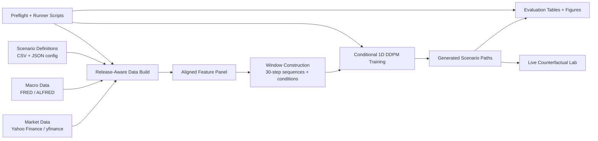

# Counterfactual Financial Scenario Generation

Counterfactual Financial Scenario Generation is a research-oriented pipeline for building release-aware macro and market datasets, training a conditional diffusion model on cross-asset return windows, evaluating generated scenarios against financial diagnostics, and surfacing the outputs in an interactive scenario lab.

The repository combines:

- a Python notebook pipeline for data assembly, training, evaluation, and scenario generation
- lightweight orchestration scripts for preflight validation and sequential notebook execution
- a Vite + React frontend for presenting live-state counterfactual scenarios

## Motivation

Standard Monte Carlo workflows often miss regime structure, macro timing realism, and cross-asset dependency patterns. This project explores whether a conditional denoising diffusion probabilistic model can generate more realistic multi-asset return paths when conditioned on:

- recent market state
- release-aware macro observations
- explicit scenario definitions

The goal is not just to fit distributions, but to generate decision-useful scenarios for stress testing, policy-shock analysis, and counterfactual portfolio research.

## Architecture



## Model Workflow

1. `release_aware_macro_loader.ipynb` builds macro series using release-aware logic, with optional ALFRED vintage enrichment when `FRED_API_KEY` is available.
2. `market_state_and_alignment_builder.ipynb` combines macro and market series into a synchronized cross-asset panel.
3. `training_prep_for_upgraded_ddpm.ipynb` creates scaled training, validation, and test windows.
4. `retrain_upgraded_ddpm.ipynb` trains the upgraded conditional DDPM on five target assets.
5. `evaluate_upgraded_ddpm.ipynb` compares generated paths with Gaussian baselines using distributional and correlation diagnostics.
6. `live_counterfactual_lab_v1.ipynb` produces scenario-level outputs for a live exploration workflow.

## Evaluation Framework

The current evaluation artifacts compare the upgraded DDPM against a Gaussian baseline across:

- mean and standard deviation error
- skew and kurtosis error
- tail quantile error at the 1%, 5%, 95%, and 99% levels
- Wasserstein distance
- lag-1 autocorrelation diagnostics
- cross-asset correlation distance
- scenario-level downside probability, VaR, and CVaR

Key result snapshots from tracked artifacts:

- Mean absolute correlation distance: DDPM `0.0380` vs Gaussian baseline `0.1414`
- Best validation loss: `0.2605` at epoch `20`
- Training run completed `28` epochs on CPU with a five-asset target universe

See [docs/results.md](docs/results.md) for more detail.

## Results And Figures

Generated evaluation figures currently live in `counterfactual_data_build/outputs/figures/` and include asset-specific upgraded evaluation charts for:

- `SPY`
- `QQQ`
- `GC`
- `CL`
- `ZN`

Live scenario outputs are also available under `counterfactual_data_build/outputs/live_counterfactuals/`, including a summary table of baseline and shock-based scenarios.

## Repository Structure

```text
.
├── README.md
├── docs/
│   ├── architecture.md
│   ├── methodology.md
│   └── results.md
├── configs/
├── outputs/
│   ├── figures/
│   └── metrics/
├── src/                            # React scenario lab
├── public/
├── executed_notebooks/             # Generated notebook runs
├── counterfactual_data_build/
│   ├── processed/                  # Generated aligned datasets and windows
│   └── outputs/                    # Figures, metrics, checkpoints, samples
├── build_*_notebook.py             # Notebook generation helpers
├── pipeline_preflight_check.py     # Environment and file validation
├── run_counterfactual_pipeline.py  # Sequential notebook runner
├── *.ipynb                         # Research and pipeline notebooks
├── dataset_spec_v1.json
├── scenario_definitions_v1.csv
└── ablation_matrix_v1.csv
```

## Setup Instructions

### Python Environment

```bash
python -m venv .venv
source .venv/bin/activate
pip install --upgrade pip
pip install -r requirements.txt
```

Optional:

```bash
export FRED_API_KEY="your_key_here"
```

If `FRED_API_KEY` is unset, the macro loader falls back to release-lag approximation mode.

### Frontend Environment

```bash
npm install
```

## How To Run

### 1. Validate the workspace

```bash
python pipeline_preflight_check.py
```

Skip external connectivity checks if needed:

```bash
python pipeline_preflight_check.py --skip-network
```

### 2. Run the notebook pipeline

```bash
python run_counterfactual_pipeline.py
```

Run a partial sequence:

```bash
python run_counterfactual_pipeline.py --start-at training_prep_for_upgraded_ddpm.ipynb
python run_counterfactual_pipeline.py --stop-after retrain_upgraded_ddpm.ipynb
```

### 3. Launch the frontend

```bash
npm run dev
```

The frontend expects a simulation API on `http://127.0.0.1:8000`. That backend is referenced by the UI but is not fully versioned in this repository, so the current frontend should be treated as a presentation layer for the scenario lab rather than a standalone deployed app.

## RAG-Enhanced Scenario Generation

The repository now includes a lightweight FastAPI-based retrieval layer under `backend/` that can ingest local project documents, build a local vector store, and retrieve relevant macro or methodological context before a scenario request is generated or evaluated.

Endpoints:

- `GET /health`
- `POST /rag/ingest`
- `POST /rag/query`
- `POST /generate-with-context`

Run the backend:

```bash
uvicorn backend.main:app --reload
```

Example ingest:

```bash
curl -X POST http://127.0.0.1:8000/rag/ingest \
  -H "Content-Type: application/json" \
  -d '{"force_rebuild": true}'
```

Example retrieval query:

```bash
curl -X POST http://127.0.0.1:8000/rag/query \
  -H "Content-Type: application/json" \
  -d '{"query": "What happens if inflation rises while unemployment increases?", "top_k": 5}'
```

Example context-aware generation:

```bash
curl -X POST http://127.0.0.1:8000/generate-with-context \
  -H "Content-Type: application/json" \
  -d '{
    "user_request": "Generate a stagflation-oriented scenario with tighter policy and weaker labor conditions.",
    "top_k": 5,
    "scenario_parameters": {
      "inflation": 0.055,
      "interest_rate": 0.0525,
      "horizon": 30,
      "path_count": 128
    }
  }'
```

The current endpoint returns retrieved context plus a clean integration placeholder. The intended production connection point is the live counterfactual inference flow currently implemented in the notebooks.

## Technologies Used

- Python
- Jupyter notebooks
- PyTorch
- NumPy
- pandas
- SciPy
- scikit-learn
- matplotlib
- yfinance
- FRED / ALFRED data access patterns
- TypeScript
- React
- Vite
- Recharts

## Contributors

- Siddharth Dandu (`sdandu-UMD`)

## Future Work

- Version the backend API used by the React scenario lab
- Move notebook logic into importable Python modules for easier testing
- Add configuration-driven experiment management under `configs/`
- Store large generated datasets and checkpoints outside git with documented retrieval steps
- Add reproducible benchmark reports for multiple seeds and market regimes
