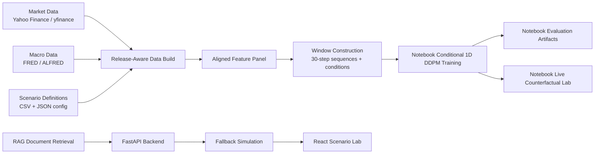

# Counterfactual Financial Scenario Generation

This repository is a **conditional diffusion research prototype** for financial counterfactual scenario generation. It explores whether a conditional denoising diffusion model can generate realistic multi-asset return paths from release-aware macro data, market-state features, and scenario definitions.

Current status, stated plainly:

- The DDPM training and evaluation work exists in notebooks.
- Prior notebook runs produced the tracked result tables and figures under `counterfactual_data_build/outputs/`.
- The FastAPI + React application currently uses fallback stochastic simulation, not real backend DDPM inference.
- Real checkpoint-backed backend DDPM inference is a planned productionization step.
- Processed data, model checkpoints, generated sample arrays, executed notebooks, and the local RAG vector store are not tracked.

See [ARTIFACTS.md](ARTIFACTS.md) for the missing artifact inventory and what breaks when those artifacts are absent.

## What This Repository Is

The project combines:

- notebook-based data, feature, training, evaluation, and scenario-generation workflows
- lightweight Python orchestration scripts for preflight checks and sequential notebook execution
- a FastAPI backend with a demo/fallback scenario simulator and local-document RAG endpoints
- a Vite + React frontend that visualizes scenario paths, risk metrics, and decision-support summaries

It should currently be described as a **research prototype with a demo application shell**, not as a production platform.

## Current Architecture



Important boundary: the notebook DDPM path and the FastAPI demo path are not yet unified. The backend does not currently load the trained DDPM checkpoint.

## Notebook Model Workflow

The main research pipeline is:

1. `release_aware_macro_loader.ipynb`
   Builds release-aware macro features from FRED/ALFRED-style data. If `FRED_API_KEY` is unavailable, it uses release-lag fallback logic.
2. `market_state_and_alignment_builder.ipynb`
   Downloads market data, constructs rolling market-state features, and merges them with the macro panel.
3. `training_prep_for_upgraded_ddpm.ipynb`
   Builds scaled train, validation, and test windows for targets and conditioning features.
4. `retrain_upgraded_ddpm.ipynb`
   Defines and trains the upgraded conditional DDPM.
5. `evaluate_upgraded_ddpm.ipynb`
   Compares generated DDPM windows with Gaussian baselines using distributional and correlation diagnostics.
6. `live_counterfactual_lab_v1.ipynb`
   Uses notebook-local DDPM inference logic to generate live scenario outputs when the required checkpoint and processed artifacts exist.

The archived `archive/realtime_counterfactual_generation_system.ipynb` is an older workflow with stale paths and checkpoint names. It is retained for research history, not as the current run path.

## Backend And Frontend Status

The backend exposes:

- `GET /health`
- `POST /rag/ingest`
- `POST /rag/query`
- `POST /generate-with-context`
- `POST /simulate`
- `POST /refresh-live-state`

Current `/simulate` behavior:

- accepts macro-style inputs such as `inflation`, `interest_rate`, `horizon`, and `path_count`
- returns frontend-compatible multi-asset return paths
- delegates generator selection through `backend/model/generator_registry.py`
- defaults to the deterministic fallback simulator unless smoke mode is explicitly enabled
- can use the smoke checkpoint-backed generator for plumbing validation when configured

The React frontend consumes `/simulate` and computes price fans, VaR/CVaR, drawdown, scenario comparisons, and recommendation-style summaries from the returned paths. Those UI analytics are real calculations, but today they are calculated from fallback simulation outputs.

### Generator Registry Architecture

Backend API routes call `backend/model/scenario_generator.py`, which is now a stable facade over `backend/model/generator_registry.py`. The registry owns inference-engine selection, artifact status reporting, and the common generator contract:

```text
FastAPI routes
    |
    v
backend/model/scenario_generator.py
    |
    v
backend/model/generator_registry.py
    |-- FallbackSimulationGenerator
    |-- SmokeDDPMGenerator
    `-- FullDDPMGenerator (future)
```

Every generator exposes:

- `load()` for model/artifact preparation
- `generate(inflation, interest_rate, horizon, path_count, ...)`
- `artifact_status()` for startup logging
- a standardized `ScenarioGenerationResponse` payload

Supported modes:

```bash
GENERATOR_MODE=fallback uvicorn backend.main:app --reload
GENERATOR_MODE=smoke_ddpm uvicorn backend.main:app --reload
```

If `GENERATOR_MODE` is unset, the backend preserves the earlier behavior:

- `SMOKE_DDPM_ENABLED=1` selects `smoke_ddpm`
- otherwise `/simulate` uses `fallback_simulation`

Startup logs report the selected generator, artifact status, and whether DDPM is enabled.

The future `full_ddpm` path should be added as another generator class in `backend/model/generator_registry.py`, registered in mode selection, and made to return the same response shape. API routes should not need changes.

## RAG Status

The RAG layer indexes local project documents using sentence-transformer embeddings and FAISS. It retrieves README/docs/context chunks for `/rag/query` and `/generate-with-context`.

RAG currently:

- retrieves document context
- returns evidence-like chunks with scores
- passes retrieved text into the fallback generator path

RAG currently does **not**:

- condition the notebook DDPM model
- alter a trained diffusion checkpoint
- perform retrieval-augmented diffusion inference

## Tracked Results

Tracked output tables and figures under `counterfactual_data_build/outputs/` come from prior notebook runs. They include:

- model config and training summary tables
- training history
- window shape summaries
- DDPM-vs-Gaussian evaluation summaries
- cross-asset correlation distance results
- asset-level evaluation figures for `SPY`, `QQQ`, `GC`, `CL`, and `ZN`
- live counterfactual PNG figures

The corresponding processed datasets, NumPy arrays, generated samples, and PyTorch checkpoints are intentionally not tracked.

## Repository Structure

```text
.
├── README.md
├── ARTIFACTS.md
├── docs/
│   ├── architecture.md
│   ├── backend.md
│   ├── methodology.md
│   ├── rag.md
│   └── results.md
├── archive/                         # stale retained research/demo files
├── backend/                         # FastAPI app, RAG, fallback simulator
├── src/                             # React scenario lab
├── public/
├── configs/
├── counterfactual_data_build/
│   └── outputs/                     # tracked summary tables and figures
├── pipeline_preflight_check.py
├── run_counterfactual_pipeline.py
├── build_*_notebook.py
├── *.ipynb                          # current notebook research pipeline
├── dataset_spec_v1.json
├── scenario_definitions_v1.csv
└── ablation_matrix_v1.csv
```

## Setup

### Python

```bash
python -m venv .venv
source .venv/bin/activate
pip install --upgrade pip
pip install -r requirements.txt
```

Optional:

```bash
export FRED_API_KEY="your_key_here"
```

If `FRED_API_KEY` is unset, the macro loader falls back to release-lag approximation mode.

### Frontend

```bash
npm install
```

## Run The Research Pipeline

There are two artifact-generation modes:

- **Full research mode** runs the notebook chain against the configured multi-asset, release-aware macro dataset. This is the default behavior.
- **Smoke validation mode** runs a small SPY-only path that writes clearly labeled artifacts under `counterfactual_data_build/smoke/`. It is meant to prove the local environment can build windows, scalers, a checkpoint, and generated samples quickly. It is not a replacement for the full research run.

Validate local setup and print artifact readiness:

```bash
python pipeline_preflight_check.py
```

Default preflight mode warns about missing DDPM artifacts but exits `0` when source files and packages are available. This is intentional because the fallback FastAPI/React demo can run without processed data or checkpoints.

Skip external connectivity checks:

```bash
python pipeline_preflight_check.py --skip-network
```

Require DDPM artifacts to exist:

```bash
python pipeline_preflight_check.py --strict
```

Strict mode exits nonzero if required DDPM artifacts are missing, including processed data, checkpoint directories, the best checkpoint, or generated sample directories.

Check smoke artifacts:

```bash
python pipeline_preflight_check.py --smoke --strict
```

Run smoke validation:

```bash
python run_counterfactual_pipeline.py --smoke
```

Smoke mode writes to `counterfactual_data_build/smoke/` and avoids overwriting full-run artifacts.

### Smoke Checkpoint-Backed Backend Inference

After smoke artifacts exist, the backend can optionally use the smoke checkpoint for `/simulate`:

```bash
GENERATOR_MODE=smoke_ddpm uvicorn backend.main:app --reload
```

For compatibility with Phase 3A, this still works when `GENERATOR_MODE` is unset:

```bash
SMOKE_DDPM_ENABLED=1 uvicorn backend.main:app --reload
```

This is a Phase 3A plumbing proof, not full research DDPM inference.

- It is SPY-only.
- It loads `counterfactual_data_build/smoke/outputs/checkpoints/conditional_ddpm_smoke_best.pt`.
- It uses the last `C_test_smoke.npy` condition window.
- It caps `path_count` at `128`.
- It caps horizon at the smoke model horizon, currently `10`.
- It ignores `inflation`, `interest_rate`, and RAG context for model conditioning.

When enabled successfully, `/simulate` returns `generator_type: "smoke_ddpm"` and `ddpm_enabled: true`. Without `GENERATOR_MODE=smoke_ddpm` or legacy `SMOKE_DDPM_ENABLED=1`, the backend remains in fallback simulation mode.

Run the notebook sequence:

```bash
python run_counterfactual_pipeline.py
```

Run a partial sequence:

```bash
python run_counterfactual_pipeline.py --start-at training_prep_for_upgraded_ddpm.ipynb
python run_counterfactual_pipeline.py --stop-after retrain_upgraded_ddpm.ipynb
```

The full notebook pipeline downloads live data, writes processed artifacts, trains a model, writes checkpoints, evaluates samples, and produces generated outputs. Those generated artifacts are ignored by git.

## Run The Demo App

This mode is a fallback simulation demo. It does not load DDPM checkpoints and does not perform real backend diffusion inference yet.

Start the backend:

```bash
uvicorn backend.main:app --reload
```

Or with Docker:

```bash
docker compose up --build
```

Start the frontend:

```bash
npm run dev
```

The frontend defaults to `http://127.0.0.1:8000`. Override the backend URL with Vite environment configuration:

```bash
VITE_API_BASE_URL=http://127.0.0.1:8000 npm run dev
```

Example fallback simulation request:

```bash
curl -X POST http://127.0.0.1:8000/simulate \
  -H "Content-Type: application/json" \
  -d '{
    "inflation": 0.03,
    "interest_rate": 0.04,
    "horizon": 30,
    "path_count": 128
  }'
```

## Productionization Gap

The major unfinished engineering step is to extract notebook DDPM inference into importable backend code. That future work should:

- load `ddpm_upgraded_model_config.json`
- load scalers from `counterfactual_data_build/processed/windows/scalers.json`
- load `counterfactual_data_build/outputs/checkpoints/conditional_ddpm_upgraded_best.pt`
- construct live/scenario condition windows
- return the same response contract currently served by `/simulate`
- make fallback simulation explicit and optional

## Technologies Used

- Python
- Jupyter notebooks
- PyTorch
- NumPy
- pandas
- SciPy
- scikit-learn
- matplotlib
- yfinance
- FRED / ALFRED data access patterns
- FastAPI
- FAISS
- sentence-transformers
- TypeScript
- React
- Vite
- Recharts
- Docker

## Author

- Sahil Parab

## Future Work

- Extract DDPM architecture and inference into importable backend modules
- Add artifact checks and a documented artifact retrieval/regeneration path
- Add end-to-end tests for real checkpoint-backed inference
- Pin Python dependencies or add a constraints file
- Make frontend API URL configurable
- Add reproducible benchmark reports across seeds and regimes
