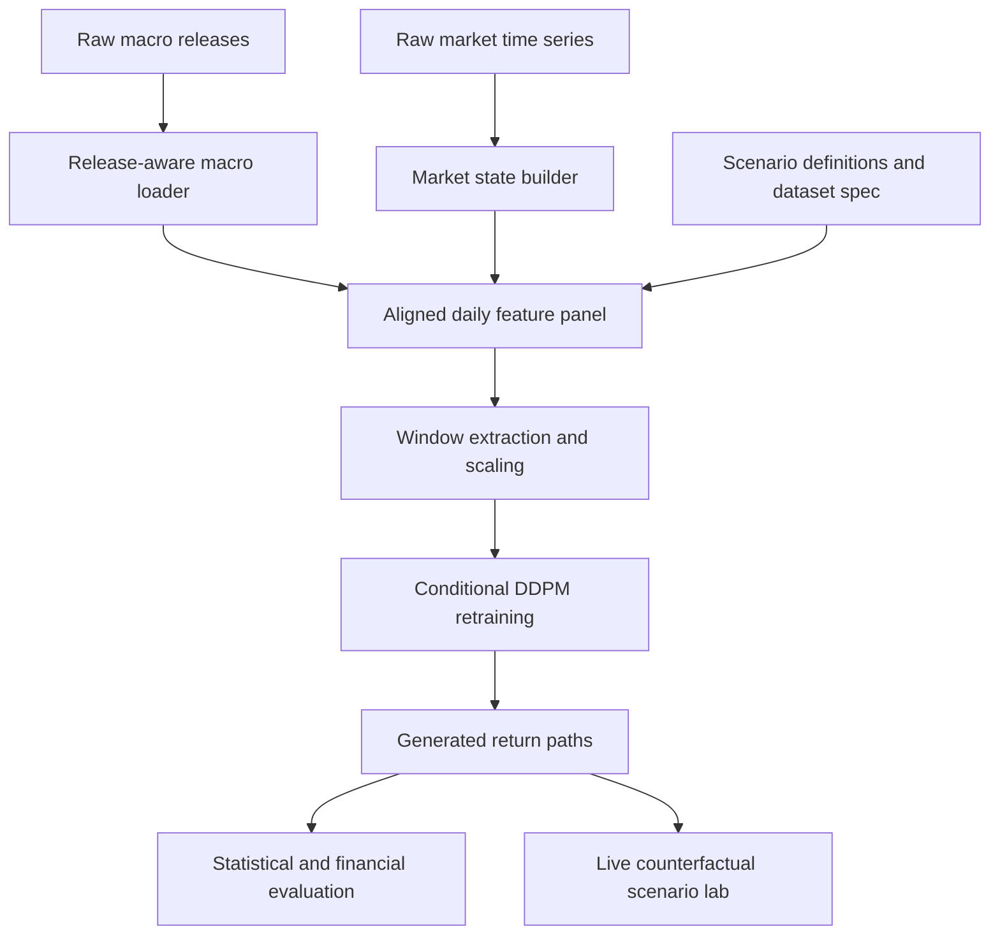

# Architecture

## Overview

The repository is organized around a research pipeline that turns raw market and macro sources into a cross-asset conditional generation workflow. The core system has three layers:

1. Data acquisition and alignment
2. Conditional generative modeling
3. Evaluation and scenario consumption

## End-to-End Pipeline

## Primary Components

### Notebook pipeline

- `release_aware_macro_loader.ipynb`
  Builds release-aware macro features and optionally uses ALFRED vintages.
- `market_state_and_alignment_builder.ipynb`
  Constructs the synchronized market and macro panel.
- `training_prep_for_upgraded_ddpm.ipynb`
  Converts the aligned panel into train/validation/test windows and conditioning tensors.
- `retrain_upgraded_ddpm.ipynb`
  Trains the upgraded conditional diffusion model.
- `evaluate_upgraded_ddpm.ipynb`
  Benchmarks generated samples against real windows and Gaussian baselines.
- `live_counterfactual_lab_v1.ipynb`
  Produces scenario-level outputs for interactive analysis.

### Automation scripts

- `pipeline_preflight_check.py`
  Confirms required files, packages, output folders, environment flags, and data-provider reachability.
- `run_counterfactual_pipeline.py`
  Executes the notebook chain in a fixed order and writes executed copies to `executed_notebooks/`.
- `build_*_notebook.py`
  Source builders that programmatically generate notebook content.

### Frontend

- `src/`
  A Vite + React scenario lab that visualizes simulated path distributions, scenario comparisons, and risk summaries.

## Artifact Layout

### Versioned source artifacts

- configuration tables: `dataset_spec_v1.json`, `scenario_definitions_v1.csv`, `ablation_matrix_v1.csv`
- notebooks and notebook builder scripts
- frontend source in `src/` and `public/`

### Generated artifacts

- `counterfactual_data_build/processed/`
  Aligned panels, feature tables, and model windows
- `counterfactual_data_build/outputs/tables/`
  Evaluation summaries and model metadata
- `counterfactual_data_build/outputs/figures/`
  Evaluation figures
- `counterfactual_data_build/outputs/checkpoints/`
  Trained model weights
- `counterfactual_data_build/outputs/generated_samples/`
  Saved generated sample arrays
- `executed_notebooks/`
  Notebook execution outputs

## Design Notes

- The repository currently emphasizes reproducible research flow over packaged-library design.
- Model logic remains notebook-centric; the polish pass intentionally does not refactor that logic.
- Generated datasets and checkpoints are better treated as derived artifacts, not permanent git assets.
